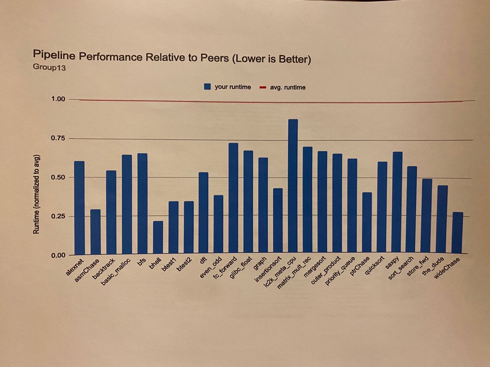

# EECS470 Pro

EECS470 Pro begin from the end of EECS 470. Since we hadn't added many cool features due to the time limitation, we want to go further after this course.

## Baseline

The baseline is the version we submit for EECS 470. 

* Average CPI: 1.88
* Period: 15ns

Below picture is the performance we achieved at the end of this course.

## Todo List

- [ ] Advanced branch predictor
- [ ] Non-blocking LSQ
- [ ] Non-blocking Dcache
